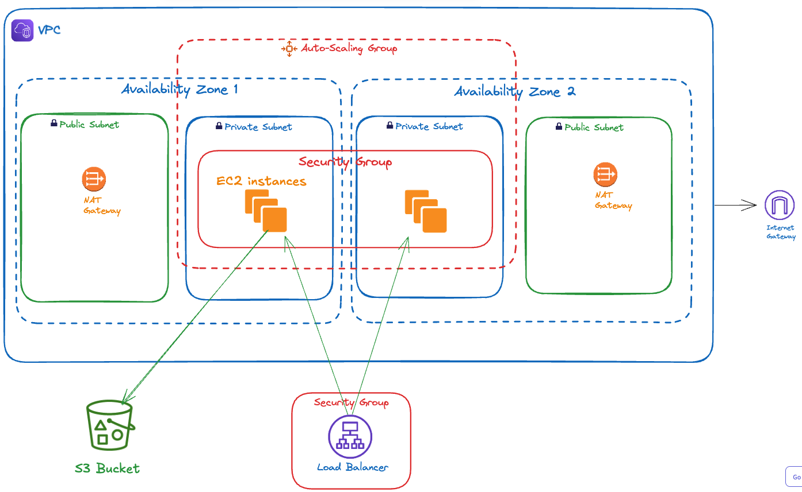

# Project: Deploy a high-availability web app using CloudFormation
This project is part of Course 3, "Deploy Infrastructure as Code (IAC)" in the Udacity "Cloud DevOps Engineer" Nanodegree program. It demonstrates how to deploy a high-availability web application using AWS CloudFormation.

The scripts under `scripts` can be used to deploy/delete both the network and app stacks.

## Table of Contents
- [Infrastructure Diagram](#infrastructure-diagram)
- [How to Deploy](#how-to-deploy)
- [The Big picture](#the-big-picture)
- [Network Key Concepts](#network-key-concepts)


## Infrastructure Diagram
The source of this diagram is [diagram/infrastructure-diagram.excalidraw](diagram/infrastructure-diagram.excalidraw), it can be imported into [excalidraw.com](excalidraw.com) and edited there.


## How to Deploy

**Deploy all Stacks**
```zsh
./scripts/deploy-network.sh
```

**Delete all stacks**
```zsh
./scripts/delete-all.sh
```

## The Big picture
What happens when an HTTP request (on port 80) lands on the server?

**1. Load Balancer Receives the Request:**
The Application Load Balancer (ALB) `Listener` is going to be the first component in your infrastructure that "listens" to that request.

**2. Routing Decision by ALB:**
The ALB evaluates the request against the listener rules defined by the `ListenerRule` component.
Since the setup has a rule for forwarding traffic coming to path `/`, the ALB forwards the request to the TargetGroup.

**3. Target Group Processing:**
The `TargetGroup` determines which instances in the Auto Scaling group (`AutoScalingGroup`) should handle the request.
The `TargetGroup` uses health checks defined in it to ensure that it forwards the request to a healthy instance.

**4. Request Reaches the EC2 Instance:**
 * The selected EC2 instance, part of the `AutoScalingGroup`, receives the request. This instance is configured with the `LaunchTemplate`.

 * IMPORTANT: Notice that the `LaunchTemplate` has an ImageId property. You need to set it up with an AMI of a new Ubuntu instance. Look for an appropriate AMI in your AWS EC2 console, and then find a link to the `AMI Catalog` from the left sidebar.

 * The `AutoScalingGroup` will spin up additional instances when needed and drop unused extra instances but will keep a minimum of `MinSize` instances. It means the EC2 instances created in the infrastructure are *ephemeral*; they do not keep their states. This fact will be important later when you need to debug your EC2 instances.

**5. Response Sent Back:**
The response from the EC2 instance (either static content or dynamically generated content) is sent back to the ALB.
The ALB then routes this response back to the client who initiated the request.

----
## Network Key Concepts

- a **VPC**  can be in a *single* **Region**, and can span *multiple* **Availability Zones**.
- a  Subnet can be in a *single* Availability Zone and a *single* **VPC.**
- a **VPC** can only connect to public internet through Internet Gateway IGW and by modifying the Route Tables.
- an **S3** is tied to a specific Region.
- When you create an **Auto-Scaling Group,** you define the subnets that it will spin up the **EC2** into, the **LaunchTemplate** used to create the instances and the settings of the scaling.
- **Security Groups** act as a virtual firewall for your EC2 instances to control inbound and outbound traffic.